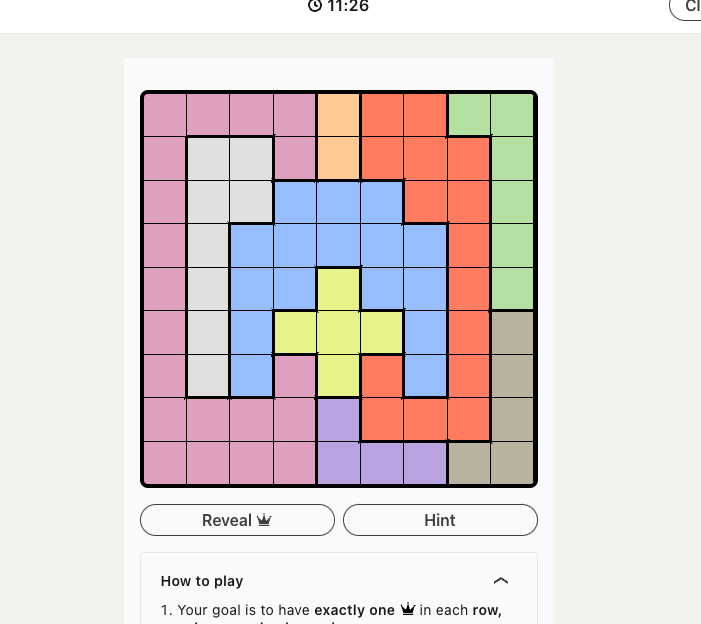
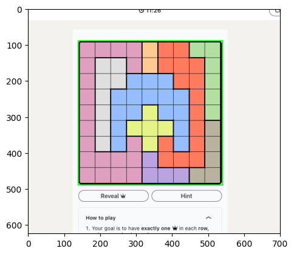
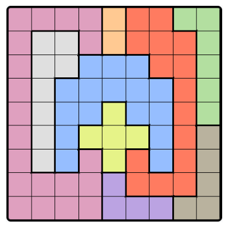
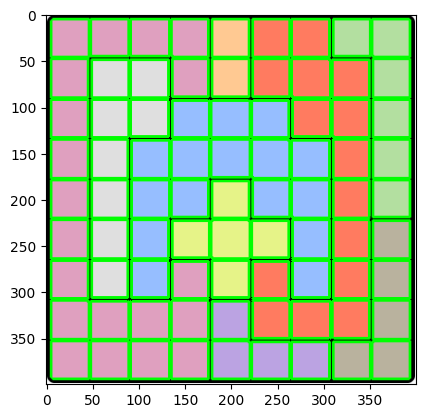
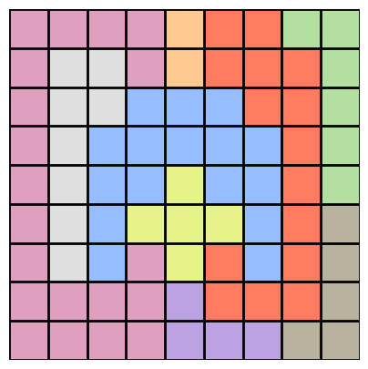

# Queens Solver

A Mixed Integer Linear Programme (MILP) solver for the Queens game on LinkedIn.

## Extracting the Game

Given a screenshot such as the following 



We first need to extract the game in order to solve it. Using opencv, we can identify the approximate quadrilateral contours within the image. Ordering these by area, we select the largesst one assuming the largest quadrilateral in the screenshot should be the game



We then crop the image



To find the cells, we look for $n^2$ approximate quadrilateral contours that are approximately of area $A/n^2$. Since we don't know $n$ beforeand, we search over $n \in \{4,5, \dots ,10\}$. 



Once we have the cells, we need to extract the internal colour from each cell. We use the median value, which ensures that any outlier values don't skew the values. We can now convert the cells and there colour values into an array representation. The grid above becomes:

```code 
array([
    [0, 0, 0, 0, 1, 2, 2, 3, 3],
    [0, 4, 4, 0, 1, 2, 2, 2, 3],
    [0, 4, 4, 5, 5, 5, 2, 2, 3],
    [0, 4, 5, 5, 5, 5, 5, 2, 3],
    [0, 4, 5, 5, 6, 5, 5, 2, 3],
    [0, 4, 5, 6, 6, 6, 5, 2, 7],
    [0, 4, 5, 0, 6, 2, 5, 2, 7],
    [0, 0, 0, 0, 8, 2, 2, 2, 7],
    [0, 0, 0, 0, 8, 8, 8, 7, 7]])
```

with a list that maps the region numbers to a colour (RGB vector):

```code
colors = [
    array([0.8745098 , 0.62745098, 0.74901961]),
    array([1.        , 0.78823529, 0.57254902]),
    array([1.        , 0.48235294, 0.37647059]),
    array([0.70196078, 0.8745098 , 0.62745098]),
    array([0.8745098, 0.8745098, 0.8745098]),
    array([0.58823529, 0.74509804, 1.        ]),
    array([0.90196078, 0.95294118, 0.53333333]),
    array([0.7254902 , 0.69803922, 0.61960784]),
    array([0.73333333, 0.63921569, 0.88627451])]
```

Plotting this gives the desired result




## MILP Solver

Representing each cell on the board as a binary value, with 0 representing an empty cell, and 1 representing the presence of a Queen, we can unravel the $n \times n$ board into a vector ${\bf x} \in \{0, 1\}^{\otimes n^2}$.

The rule dictating that each row and column can only contain a single Queen can be expressed as a linear constraint over ${\bf x}$

```math
\begin{bmatrix}
    {\mathbb I}_n \otimes {\bf 1}_n^{T} \\
    {\bf 1}_n^{T} \otimes {\mathbb I}_n
\end{bmatrix} {\bf x} = {\bf 1}_{2n}
```

To encode the constraint to restrict adjacent Queens, we need to restrict the sum of cells in all $2 \times 2$ blocks to be less than or equal to 1. This ensures that no more than 1 Queen appears in any $2 \times 2$ block, thus ensuring the adjacency rule. In the $n^2$ vector space of ${\bf x}$, a $2 \times 2$ block is given by vectors of the form

```math
[0, \dots, 0, 1, 1, \overbrace{0,0,\dots, 0,0}^{n-2},1,1,0,\dots,0]
```

To cover all blocks on the board, the elements $1,1,\overbrace{0,0,\dots, 0,0}^{n-2},1,1$ must occupy all available valid spaces in the $n^2$ vector, note that it's possible to find an invalid configuration where the 1s straddle 2 rows. This happens exactly $n-2$ times, therefore there are $n^2 - (n+2) + 1$ positions for the $n+2$ length vector to occupy in the $n^2$ vector, and $n-2$ are invalid, giving 

```math
n^2 - (n+2) + 1 -(n-2) = (n-1)^2
```

Defining each of the $(n-1)^2$ vectors as ${\bf t}_1 :=[1,1,0,\dots,0,1,1,0,\dots,0]$ to ${\bf t}_{(n-1)^2} :=[0,\dots,0,1,1,0,\dots,0,1,1]$, we can combine these into the matrix 

```math
T = \begin{bmatrix}
{\bf t}_1 \\
\vdots \\
{\bf t}_{(n-1)^2}
\end{bmatrix}
```

giving the constraints

```math
T {\bf x} \leq {\bf 1}_{(n-1)^2} \\
T {\bf x} \geq {\bf 0}_{(n-1)^2}
```

Finally, to add a constraint for each region, we need to express each region as a set of indices of each cell of a region in the $n^2$ basis of ${\bf x}$, i.e. region $i$ is

```math
r_i := \{ r_{i,1}, r_{i,2} \dots r_{i,m} \}
```

where $r_{i,j} \in \{1, 2, \dots, n^2\}$. 